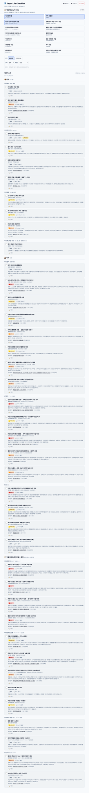

# 🗾 Japan Life Checklist

일본 거주 한국인(외국인)을 위한 **이사 · 이직 · 필수 행정 자가 검토 체크리스트**.

개인마다 상황이 다르므로, 상단 **「내 상황(My Profile)」** 토글을 켜면 그에 해당하는 항목만 골라서 보여줍니다. 진행 상황(체크·메모)은 **브라우저 localStorage**에만 저장되며 서버로 전송되지 않습니다.

**공개 URL → <https://dev-sl0xw.github.io/japan-life-checklist/>**



## 특징

- **조건부 공개**: 이사/이직/공백기/자동차/면허/자녀·배우자/비자변경 등 14개 플래그로 내 상황에 맞는 항목만 표시
- **두 가지 보기**: 도메인별(이사·이직·행정) / 타임라인순(D-60 → D-Day → D+30…)
- **위험도 분류**: 🟥 법정기한 / 🟧 금전손실 / 🟨 서비스중단 / ⬜ 편의 — 색 + 텍스트로 구분
- **공식 출처**: 법정기한·금전 항목은 出入国在留管理庁·協会けんぽ·日本年金機構·国税庁·国土交通省·警視庁·e-Gov·自治体 등 1차 공식 출처를 명시 (확인일 표기)
- **한·일 병기 + 양방향 검색**: 한국어로 검색해도 일본어 원문(`任意継続` 등)에 매치
- **메모 · 진행률 · 내보내기/가져오기**: 백업 JSON으로 기기 간 이전 가능
- **접근성**: 키보드 조작, 색맹 대응(텍스트 라벨 동반), 다크모드 자동, 44px 터치 타깃

## 사용법

```bash
git clone https://github.com/dev-sl0xw/japan-life-checklist.git
cd japan-life-checklist
npm run serve   # 또는: python3 -m http.server 8000
```

브라우저에서 <http://localhost:8000> 접속.

> ⚠️ `index.html`을 `file://`로 직접 열면 `fetch()`가 차단됩니다. 반드시 정적 서버를 통해 접속하세요.

## 데이터 보관 ⚠️ 중요

- 체크·메모·프로필 토글은 **사용자 브라우저의 localStorage**에만 저장됩니다.
- **서버 전송 없음** / 다른 사용자와 공유되지 않음.
- 브라우저·디바이스·시크릿 모드·in-app 브라우저(LINE/Slack/Kakao 등)별로 데이터가 **분리**됩니다. 시크릿/in-app에서는 새로고침 시 사라질 수 있습니다.
- **백업·이전**: 상단 **「내보내기」**로 JSON을 저장하고, 다른 기기에서 **「가져오기」**로 복원하세요.

## 면책

이 체크리스트는 참고용입니다. 법정기한·절차는 제도 개정·지자체·개인 상황에 따라 달라질 수 있으니, **반드시 각 항목의 공식 출처와 거주 지자체·관할 기관에서 최신 내용을 확인**하세요. 본 저장소는 정보의 정확성·최신성을 보증하지 않습니다.

## 기여

항목 추가·수정 전 [`docs/CONTRIBUTING.md`](docs/CONTRIBUTING.md)를 확인해 주세요. `risk_level`별로 출처·확인일 요구사항이 다릅니다.

PR마다 GitHub Actions가 `node scripts/validate-items.mjs`로 자동 검증합니다. 로컬 검증:

```bash
node scripts/validate-items.mjs   # 또는: npm run validate
```

스키마 버전 변경 시 [`docs/MIGRATION.md`](docs/MIGRATION.md)를 따라 마이그레이션을 작성하세요.

## 현재 범위 (v1) 와 로드맵

**v1**: 이사 + 이직 + 그에 직결되는 외국인/한국인 필수 행정(재류카드·마이넘버·사회보험·연금·주민세·퇴직문서·은행·통신·NHK·자동차).

**v1.5+ (예정)**: 한국 세무·외환·영사관·병역·해외재산조서, 영구귀국, 자녀학교 상세, 펫, 자가매각, 지역(도쿄/오사카/후쿠오카)팩, 한↔일 언어 토글, PWA.

## 라이선스

MIT — 자유롭게 fork·재배포·재사용 가능. [`LICENSE`](LICENSE) 참조.
